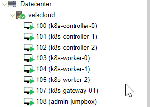
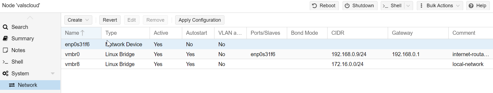
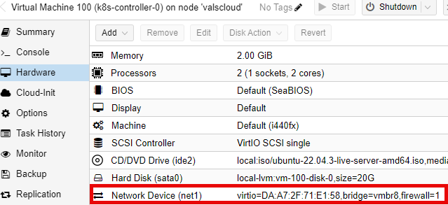
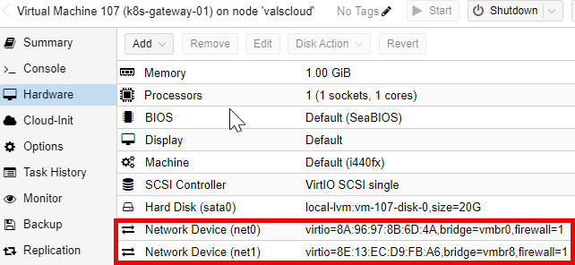
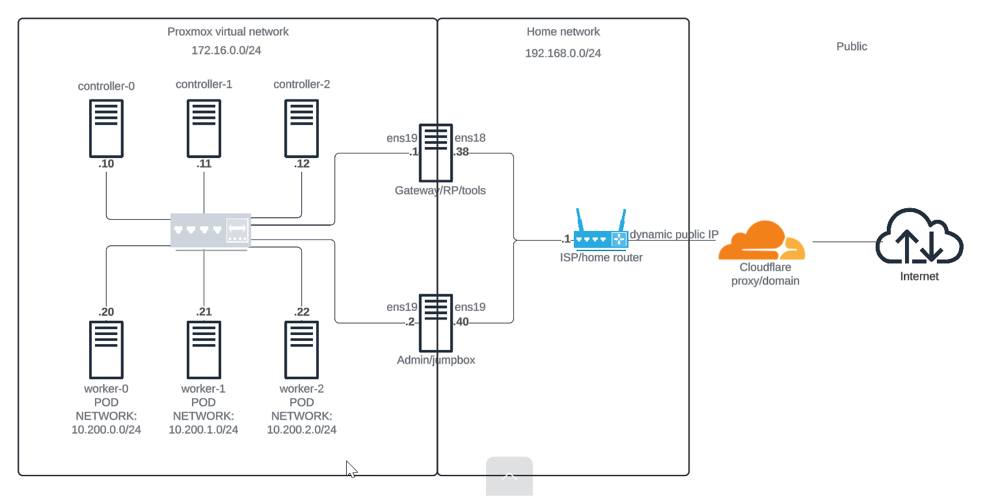

# Prerequisites

## Proxmox Hypervisor

This tutorial is intended to be performed with a [Proxmox](https://proxmox.com/en/) hypervisor, but you can also use it with ESXi, KVM, Virtualbox or other hypervisor.

> The compute resources required for this tutorial is 25GB of RAM and 140GB HDD (or SSD).

List of the VM used in this tutorial :

|Name|Role|vCPU|RAM|Storage (thin)|IP|OS|
|--|--|--|--|--|--|--|
|controller-0|controller|2|4GB|20GB|172.16.0.10/24|Ubuntu|
|controller-1|controller|2|4GB|20GB|172.16.0.11/24|Ubuntu|
|controller-2|controller|2|4GB|20GB|172.16.0.12/24|Ubuntu|
|worker-0|worker|2|4GB|20GB|172.16.0.20/24|Ubuntu|
|worker-1|worker|2|4GB|20GB|172.16.0.21/24|Ubuntu|
|worker-2|worker|2|4GB|20GB|172.16.0.22/24|Ubuntu|
|gateway-01|Reverse Proxy, client tools, gateway|1|1GB|20GB|192.168.0.38/24 + 172.16.0.1/24|Debian|
|admin-jumpbox|jumpbox/admin tasks|1|4GB|20GB|172.16.0.22/24|Ubuntu|

On the Proxmox hypervisor, I just added the `k8s-` prefix in the VM names.



## Prepare the environment

### Hypervisor network

For this tutorial, you need 2 networks on your Proxmox hypervisor :

* a network bridge to your local network (`vmbr0` in the following screenshot). This network has access to the internet, hence serves as the public network bridge.
* a Proxmox virtual private network bridge (`vmbr8` in the following screenshot). This network has no direct internet connectivity and routes traffic via `gateway-01`. Hence, the jumpbox is used to connect to all the nodes within this network. 



> Quick tip: when creating the K8s VMs on Proxmox, add both network interfaces to them initially as they need internet connectivity during installation/for updates. You can detach the `vmbr8` interface from the VM after build.

Here is a sample of the network config for one of the servers in the virtual private network:

```bash
root@controller-0:/# cat /etc/netplan/00-installer-config.yaml 
network:
  version: 2
  ethernets:
    ens18:
      dhcp4: true
      dhcp4-overrides:
        use-routes: false
    ens19:
      dhcp4: no
      addresses:
        - 172.16.0.10/24
      gateway4: 172.16.0.1
      nameservers:
        addresses:
          - 8.8.8.8
          - 8.8.4.4
      routes:
        - to: 172.16.0.0/24
          via: 172.16.0.1
          scope: link
```


> Note: the pods networks will be defined later.

All the Kubernetes nodes (workers and controllers) only need one network interface linked to the virtual private network (`vmbr8`).



The reverse proxy/client tools/gateway and admin/jumpbox VMs need 2 network interfaces, one linked to the virtual private network (`vmbr8`) and the other linked to the local network (`vmbr0`).



### Network architecture

This diagram represents the network design:



> If you want, you can define the IPv6 stack configuration.

### Gateway VM installation

> The basic VM installation process is not the purpose of this tutorial.
>
> Because it's just a tutorial, the IPv6 stack is not configured, but you can configure it if you want.

This VM is used as a NAT gateway for the virtual private network, as a reverse proxy and as a client tools.

This means all the client steps like certificates generation will be done on this VM (in the next parts of this tutorial).

You have to:

* Install the latest [amd64 Debian netinst image](https://www.debian.org/CD/netinst/) on this VM.

* Configure the network interfaces (see the network architecture). Example of `/etc/network/interfaces` file if your local network interface is ens18 and your Proxmox virtual private interface is ens19:

```bash
root@gateway-01:~# cat /etc/network/interfaces
# This file describes the network interfaces available on your system
# and how to activate them. For more information, see interfaces(5).

source /etc/network/interfaces.d/*

# The loopback network interface
auto lo
iface lo inet loopback

# The primary network interface
allow-hotplug ens18
iface ens18 inet dhcp

# Add the following configuration for ens19
auto ens19
iface ens19 inet static
    address 172.16.0.1
    netmask 255.255.255.0
```

> Note: I did not configure the IP address for ens19 as static because it is managed automatically by my network/router (DHCP); same goes for DNS. To ensure stability, I have reserved the IP addresses for all VMs within the local network range on the router, to prevent them from from changing.

> If you want, you can define the IPv6 stack configuration.
>
> If you want, you can use another DNS resolver.

* Define the VM hostname:

```bash
sudo hostnamectl set-hostname gateway-01
```

* Update the packages list and update the system:

```bash
sudo apt-get update && sudo apt-get upgrade -y
```

* Install SSH, vim, tmux, curl, NTP and iptables-persistent:

```bash
sudo apt-get install ssh vim tmux curl ntp iptables-persistent -y
```

* Enable and start the SSH and NTP services:

```bash
sudo systemctl enable ntp
sudo systemctl start ntp
sudo systemctl enable ssh
sudo systemctl start ssh
```

* Enable IP routing:

```bash
sudo echo 'net.ipv4.ip_forward=1' >> /etc/sysctl.conf
sudo echo '1' > /proc/sys/net/ipv4/ip_forward
```

> If you want, you can define the IPv6 stack configuration.

* Configure the iptables firewall (allow some ports and configure NAT). Example of `/etc/iptables/rules.v4` file if ens18 is your local network interface and ens19 is your private interface:

```bash
# Generated by xtables-save v1.8.2 on Fri Jun  5 16:45:02 2020
*nat
-A POSTROUTING -o ens18 -j MASQUERADE
COMMIT

*filter
-A INPUT -i lo -j ACCEPT
# allow ssh, so that we do not lock ourselves
-A INPUT -i ens18 -p tcp -m tcp --dport 22 -j ACCEPT
-A INPUT -i ens18 -p tcp -m tcp --dport 80 -j ACCEPT
-A INPUT -i ens18 -p tcp -m tcp --dport 443 -j ACCEPT
-A INPUT -i ens18 -p tcp -m tcp --dport 6443 -j ACCEPT
-A INPUT -i ens18 -p icmp -j ACCEPT
# allow incoming traffic to the outgoing connections,
# et al for clients from the private network
-A INPUT -m state --state RELATED,ESTABLISHED -j ACCEPT
# prohibit everything else incoming
-A INPUT -i ens18 -j DROP
COMMIT
# Completed on Fri Jun  5 16:45:02 2020
```

> If you want, you can define the IPv6 stack configuration.

* If you want to restore/active iptables rules:

```bash
sudo iptables-restore < /etc/iptables/rules.v4
```

* Configure the `/etc/hosts` file:

```bash
127.0.0.1       localhost
192.168.0.1     gateway-01.external gateway-01

# The following lines are desirable for IPv6 capable hosts
::1             localhost ip6-localhost ip6-loopback
ff02::1         ip6-allnodes
ff02::2         ip6-allrouters

172.16.0.10    controller-0
172.16.0.11    controller-1
172.16.0.12    controller-2

172.16.0.20    worker-0
172.16.0.21    worker-1
172.16.0.22    worker-2
```

* To confirm the network configuration, reboot the VM and check the active IP addresses:

```bash
sudo reboot
```

### Kubernetes nodes VM installation

> The basic VM installation process is not the purpose of this tutorial.
>
> Because it's just a tutorial, the IPv6 stack is not configured, but you can configure it if you want.

These VM are used as Kubernetes node (controllers or workers).

The basic VM configuration process is the same for the 6 VM (you can also configure one, clone it and change IP address and hostname for each clone).

 > Remember ☝🏽✍🏽: when creating the K8s node VMs on Proxmox, add both network interfaces to them initially as they need internet connectivity during installation/for updates. You can detach the `vmbr8` interface from the VM after build.

You have to:

* Install the [Ubuntu 22.04.3 LTS Server install image](https://releases.ubuntu.com/22.04/) on this VM.

* Configure the network interface (see the network architecture). Example of `/etc/netplan/00-installer-config.yaml` file if ens18 is the name of your Proxmox virtual private network interface (you need to change the IP address depending on the installed server):

```bash
root@controller-0:/# cat /etc/netplan/00-installer-config.yaml 
network:
  version: 2
  ethernets:
    ens18:
      dhcp4: true
      dhcp4-overrides:
        use-routes: false
    ens19:
      dhcp4: no
      addresses:
        - 172.16.0.10/24
      gateway4: 172.16.0.1
      nameservers:
        addresses:
          - 8.8.8.8
          - 8.8.4.4
      routes:
        - to: 172.16.0.0/24
          via: 172.16.0.1
          scope: link
```

> If you want, you can define the IPv6 stack configuration.
>
> If you want, you can use another DNS resolver.

* Define the VM hostname (example for controller-0):

```bash
sudo hostnamectl set-hostname controller-0
```

* Update the packages list and update the system:

```bash
sudo apt-get update && sudo apt-get upgrade -y
```

* Install SSH and NTP:

```bash
sudo apt-get install ssh ntp -y
```

* Enable and start the SSH and NTP services:

```bash
sudo systemctl enable ntp
sudo systemctl start ntp
sudo systemctl enable ssh
sudo systemctl start ssh
```

* Configure `/etc/hosts` file. Example for controller-0:

```bash
127.0.0.1 localhost
127.0.1.1 controller-0

# The following lines are desirable for IPv6 capable hosts
::1     ip6-localhost ip6-loopback
fe00::0 ip6-localnet
ff00::0 ip6-mcastprefix
ff02::1 ip6-allnodes
ff02::2 ip6-allrouters
# Example entry to add to all nodes' /etc/hosts
172.16.0.11    controller-1
172.16.0.12    controller-2
172.16.0.20    worker-0
172.16.0.21    worker-1
172.16.0.22    worker-2
192.168.0.1    gateway-01
```

* To confirm the network configuration, reboot the VM and check the active IP address:

```bash
sudo reboot
```

## Setting up admin server/jumpbox and DDNS (Dynamic DNS)

#### Admin server/jumpbox setup
This VM is used for accessing the K8s node machines as they can not be accessed directly from the local network (`192.168.0.0/24`). Not much configuration is needed except assigning it the required interfaces as shown in the network diagram and configuring SSH keys to be used for connecting to the K8s nodes.  

#### DDNS (Dynamic DNS) configuration
- [Register a domain with Cloudflare](https://developers.cloudflare.com/registrar/get-started/register-domain/). If you already have a domain registered elsewhere, then [add your domain/site on Cloudflare](https://developers.cloudflare.com/fundamentals/setup/manage-domains/add-site/) and [update the nameservers at your domain registrar to point to Cloudflare as your authoritative DNS server](https://developers.cloudflare.com/dns/zone-setups/full-setup/setup/).

>
- [Add a DNS record (A record) on the site](https://developers.cloudflare.com/dns/manage-dns-records/how-to/create-dns-records/) to map your domain to your home router's current public IP address.

> Tip: This is optional but I highly recommend enabling `proxied status` when adding the A record.

>
- [Install DDClient and configure it with your registered domain](https://strangebutohwell.gitbook.io/knowledge/linux/applications/ddclient/installing-latest-ddclien; ignore the PHP installation part of the guide. Here is an example of a working ddclient.conf:

```bash
root@jumpbox:/etc/ddclient# cat ddclient.conf 
daemon=600  # check every 10 minutes
ssl=yes     # use ssl-support
use=web     # acquire current IP address via web URL

##
## Cloudflare
protocol=cloudflare,        \
zone=your-domain.com,            \
ttl=1,                      \
login=your-email-address,    \
password=your-cloudflare global-api-key   \
your-domain.com
```
>
- Configure ddclient to run as a daemon by modifying  `/etc/default/ddclient ` file to include the correct daemon settings below:

```bash
# /etc/default/ddclient

# Set to "true" if ddclient should run in daemon mode
run_daemon="true"

# Set the interval in seconds between updates
daemon_interval="600"
```

> Note: I used [global API key for this setup](https://developers.cloudflare.com/dns/manage-dns-records/how-to/create-dns-records/), not API token which is the best choice fo production environments.

- Apply the changes by restarting the ddclient service and test

```bash
# restart the ddclient service
sudo systemctl restart ddclient
sudo systemctl enable ddclient
```

```bash
# check service status
sudo systemctl status ddclient
```

```bash
# get current public IP address
sudo ddclient -query
```

```bash
# confirm that IP address update on Cloudflare works
sudo ddclient -daemon=0 -verbose -noquiet -force
```

## Running Commands in Parallel with tmux

[tmux](https://github.com/tmux/tmux/wiki) can be used to run commands on multiple compute instances at the same time. Labs in this tutorial may require running the same commands across multiple compute instances, in those cases consider using tmux and splitting a window into multiple panes with synchronize-panes enabled to speed up the provisioning process.

> The use of tmux is optional and not required to complete this tutorial.


> Enable synchronize-panes by pressing `ctrl+b` followed by `shift+:`. Next type `set synchronize-panes on` at the prompt. To disable synchronization: `set synchronize-panes off`.

Next: [Installing the Client Tools](02-client-tools.md)
